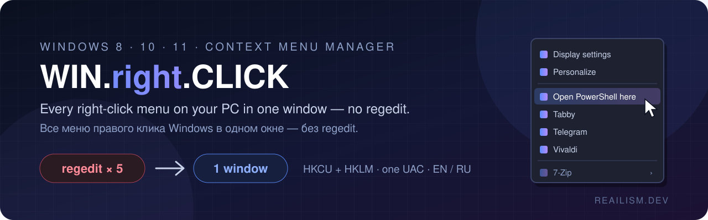
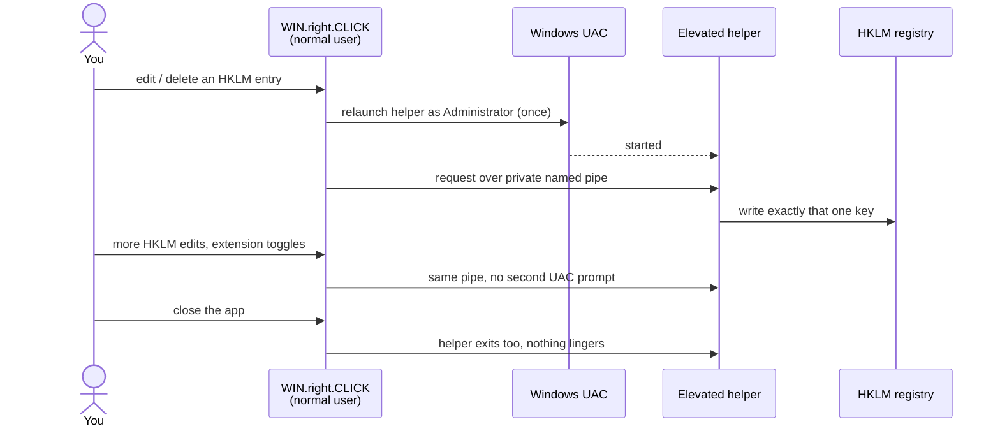
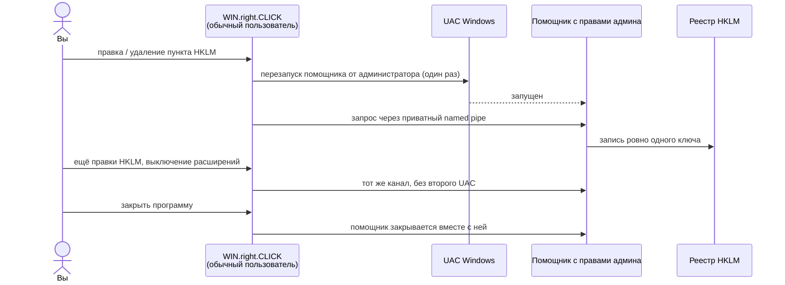

<div align="center">

> 🇷🇺 **Русская версия доступна ниже** — [перейти к русской документации ↓](#ru)



# 🖱️ WIN.right.CLICK

**A simple app to add, edit, and remove entries in your Windows right-click menu — no registry editor needed.**


[**Download**](https://github.com/dobrdigital/WIN.right.CLICK/releases/latest) · [**Screenshot**](#️-what-it-looks-like) · [**The 5 tabs**](#-the-5-tabs) · [**Features**](#-features) · [**How HKLM unlock works**](#-how-the-locked-entries-get-unlocked) · [**Русский**](#ru)

</div>

---

## 📥 Install: download → run

1. **[Download the zip](https://github.com/dobrdigital/WIN.right.CLICK/releases/latest)**
2. **Unzip it**
3. **Double-click `WIN.right.CLICK.exe`**

That's it — no installer, no setup wizard.

---

Windows gives you no real way to edit the right-click menu yourself. The only
option is `regedit` — digging through several different, obscurely-named
registry locations, guessing what each cryptic entry actually does, and hoping
you don't break something in the process. Some entries can't even be
changed without administrator rights, because a program's installer put them
somewhere only admins can touch.

**WIN.right.CLICK** replaces all of that with one simple window. It shows
every right-click menu on your PC — desktop, folders, files, "Send to", and
extensions like 7-Zip — in one place, in plain language instead of cryptic
codes. You can add your own entries, edit or remove anyone's, and even the
"locked" (admin-only) ones unlock with a single permission prompt. The
interface is available in **English and Russian** — switch anytime with the
`EN`/`RU` buttons at the top.

## 🔥 Why you'll love it

| ❌ Without it | ✅ With WIN.right.CLICK |
|---|---|
| Edit the menu → open `regedit` → guess which of 5+ registry roots to touch | One GUI: Desktop / Folders / Files / Send To / Extensions, all in one place |
| A wall of CLSIDs — no idea which one is "Give access to" or your antivirus | Known Microsoft components resolved to real names, plus DLL/company info for the rest |
| Entries like `@shell32.dll,-8506` show up as raw gibberish | Resolved to the real localized text, exactly like Explorer shows it |
| A third-party installer wrote its entry into `HKEY_LOCAL_MACHINE` → permanently stuck | One UAC prompt unlocks **editing and deleting** HKLM entries for the rest of the session |
| Shell extensions (7-Zip, antivirus, etc.) can only be killed by uninstalling the whole program | Reversible enable/disable — the same "`-CLSID`" trick ShellExView uses |
| No idea what a mystery entry like `wsl.exe` or `RunAs` actually does | One click (**?**) looks it up for you |

## 🖥️ What it looks like


Every tab is a live, editable table — not a static viewer. The `⋯`/`?` columns
on the right are per-row buttons (open containing folder / search online),
and the panel on the far right is a live preview of the actual right-click menu.

## 🧭 The 5 tabs

| Tab | What it manages | Backing store |
|---|---|---|
| 🖥️ **Desktop** | Right-click on empty desktop | `DesktopBackground\shell`, `Directory\Background\shell` |
| 📁 **Folders** | Right-click on a folder | `Directory\shell` |
| 📄 **Files** | Right-click on any file | `*\shell` |
| 📤 **Send To** | The "Send to" submenu | `%APPDATA%\Microsoft\Windows\SendTo` (plain shortcuts, not registry) |
| 🧩 **Extensions** | COM shell extensions (7-Zip, "Give access to", antiviruses...) | `shellex\ContextMenuHandlers` across all scopes |

Every tab reads **both** `HKCU` and `HKLM` — so nothing is hidden, whoever
created it.

## ✨ Features

- 🖱️ **Full control** of Desktop / Folder / File / Send To / Extensions right-click menus, in one app.
- 🔍 **See everything real** — your own entries, other programs', and Windows' own, not just what this tool created.
- 🔒 **Elevated edit & delete for HKLM** ("common to all users") entries — one UAC prompt unlocks the rest of the session, not one prompt per click.
- 🧩 **Shell extensions toggle** — safe, reversible enable/disable, no uninstalling.
- 📂 **"⋯" jumps straight to the file's folder** (resolves bare names like `cmd.exe`/`wsl.exe` via PATH, exactly like Windows does).
- ❓ **"?" looks up any entry online** — paste-free, one click to DuckDuckGo.
- 🧠 **Decodes indirect strings** (`@shell32.dll,-8506` → the real text Explorer shows).
- 📦 **Export / import** your whole menu as JSON.
- 🔄 **Live auto-refresh** — the table updates the instant the registry changes, even from another program.
- 🌙 **Dark theme by default** — classic WinForms has no native dark mode, so every control is custom-themed.
- 🌍 **English and Russian** — switch anytime with the `EN`/`RU` buttons, no restart hunting required.
- 🪶 **Single .exe, no installer** — .NET Framework 4.8, no external runtime to install on Windows 10/11.

## ⚡ Install

> Requirements: Windows 8+, .NET Framework 4.8 (preinstalled on Windows 10/11).

**Option A — release zip:** download `WIN.right.CLICK-0.99-beta.zip` from the
[Releases](https://github.com/dobrdigital/WIN.right.CLICK/releases/latest) page, unzip, run
`WIN.right.CLICK.exe`. No installer.

**Option B — build from source** (needs the [.NET SDK](https://dotnet.microsoft.com/download)):

```bash
git clone https://github.com/dobrdigital/WIN.right.CLICK
cd WIN.right.CLICK
dotnet build -c Release
```

Run it from `bin\Release\net48\WIN.right.CLICK.exe`.

## 🔍 How the "locked" entries get unlocked

An entry registered in `HKEY_LOCAL_MACHINE` isn't necessarily "part of
Windows" — it's just registered **for every user of the machine**, which is
exactly what most installers do by default. WIN.right.CLICK can edit and
delete these too:



1. The first time you try, it asks to relaunch one small helper process as
   Administrator (a single UAC prompt).
2. That helper stays alive in the background for the rest of the session,
   listening on a private named pipe.
3. Every further HKLM change in that session — editing another entry,
   deleting one, toggling a shell extension — reuses the same helper.
   **No second UAC prompt.**
4. Closing the app closes the helper with it. Nothing lingers.

## 🔒 Safe & transparent

- 📵 **No telemetry, no background network calls.** The only thing that ever
  touches the network is the explicit **"?"** button, which opens *your*
  browser to a DuckDuckGo search — nothing is sent anywhere by the app itself.
- ↩️ **Deletion is reversible where Windows allows it** — shell extensions are
  disabled with the same non-destructive prefix trick ShellExView uses, never
  deleted outright.
- 🎯 **Every registry write is scoped precisely** to the one key you're
  editing — no bulk changes, no registry cleaning, no "optimize my PC" magic.
- 🛡️ Elevation is requested only for the specific action that needs it, never to
  run the app itself (it runs as a normal user by default).

## ⚠️ Known limitation

The vertical scrollbar stays the native Windows color on some builds — the
undocumented dark-mode API Windows itself uses for it doesn't always kick in
for third-party apps. Everything else is fully themed. Cosmetic only.

## 📦 Dependencies

.NET Framework 4.8 (runtime) + [`Svg`](https://github.com/svg-net/SVG) (NuGet,
only for rendering an optional logo). Nothing else.

## 📄 License

[MIT](LICENSE). Free to use, fork, and build on.

---

<div align="center">

*Built with ❤ at **REAILISM.DEV** — because your right-click menu deserves better than regedit.*

</div>

---

<a name="ru"></a>

<details>
<summary><b>🇷🇺 Русская документация — нажмите, чтобы развернуть</b></summary>

<br>

<div align="center">

# 🖱️ WIN.right.CLICK

**Простая программа для добавления, редактирования и удаления пунктов меню правого клика — без редактора реестра.**

[**Скачать**](https://github.com/dobrdigital/WIN.right.CLICK/releases/latest) · [**5 вкладок**](#-5-вкладок) · [**Возможности**](#-возможности) · [**Как разблокируется HKLM**](#-как-разблокируются-заблокированные-пункты)

</div>

---

## 📥 Установка: скачать → запустить

1. **[Скачать zip](https://github.com/dobrdigital/WIN.right.CLICK/releases/latest)**
2. **Распаковать**
3. **Запустить `WIN.right.CLICK.exe`**

Всё — установщик не нужен.

---

Windows не даёт нормального способа отредактировать меню правого клика самому.
Единственный вариант — `regedit`: копаться по нескольким малопонятно
названным веткам реестра, гадать, что на самом деле делает тот или иной
пункт, и надеяться ничего не сломать. Некоторые пункты вообще нельзя
изменить без прав администратора — их записал туда установщик какой-то
программы.

**WIN.right.CLICK** заменяет всё это одним простым окном. Оно показывает все
меню правого клика на компьютере — рабочий стол, папки, файлы, «Отправить» и
расширения вроде 7-Zip — в одном месте и понятным языком, а не набором кодов.
Можно добавлять свои пункты, редактировать или удалять чужие, а
«заблокированные» (только для администратора) пункты разблокируются одним
запросом прав. Интерфейс доступен на **английском и русском** — переключить
можно в любой момент кнопками `EN`/`RU` вверху.

## 🔥 Почему это удобно

| ❌ Без программы | ✅ С WIN.right.CLICK |
|---|---|
| Правка меню → `regedit` → гадать, какую из 5+ веток реестра трогать | Одно окно: Рабочий стол / Папки / Файлы / Отправить / Расширения |
| Стена CLSID — непонятно, где «Предоставить доступ», а где антивирус | Известные компоненты Microsoft подписаны реальными именами, для остальных — DLL и компания |
| Пункты вида `@shell32.dll,-8506` показываются как абракадабра | Расшифровываются в настоящий текст — ровно как в Проводнике |
| Установщик записал пункт в `HKEY_LOCAL_MACHINE` → не удалить | Один запрос UAC открывает **правку и удаление** HKLM до конца сессии |
| Расширение (7-Zip, антивирус) убирается только удалением всей программы | Обратимое включение/выключение — тот же приём «`-CLSID`», что у ShellExView |
| Непонятно, что делает загадочный `wsl.exe` или `RunAs` | Один клик по **?** — и поиск уже открыт |

## 🖥️ Как это выглядит


Каждая вкладка — живая редактируемая таблица, а не просмотрщик. Колонки `⋯`/`?`
справа — кнопки для строки (открыть папку / поискать в интернете), а панель
справа — живой предпросмотр настоящего контекстного меню.

## 🧭 5 вкладок

| Вкладка | Что управляет | Где хранится |
|---|---|---|
| 🖥️ **Рабочий стол** | ПКМ по пустому рабочему столу | `DesktopBackground\shell`, `Directory\Background\shell` |
| 📁 **Папки** | ПКМ по папке | `Directory\shell` |
| 📄 **Файлы** | ПКМ по любому файлу | `*\shell` |
| 📤 **Отправить** | Подменю «Отправить» | `%APPDATA%\Microsoft\Windows\SendTo` (обычные ярлыки, не реестр) |
| 🧩 **Расширения** | COM-расширения оболочки (7-Zip, «Предоставить доступ», антивирусы...) | `shellex\ContextMenuHandlers` во всех ветках |

Каждая вкладка читает **и** `HKCU`, **и** `HKLM` — ничего не скрыто, кто бы ни создал пункт.

## ✨ Возможности

- 🖱️ **Полный контроль** над меню рабочего стола / папок / файлов / «Отправить» / расширений — в одном приложении.
- 🔍 **Показывает всё реальное** — свои пункты, чужих программ и Windows, а не только созданное этим инструментом.
- 🔒 **Права администратора для HKLM** запрашиваются один раз за сессию, а не на каждое действие.
- 🧩 **Выключатель расширений** — безопасно и обратимо, без удаления программы.
- 📂 **«⋯» открывает папку с файлом** пункта (понимает и голые имена вроде `cmd.exe`/`wsl.exe` — через PATH, как сама Windows).
- ❓ **«?» ищет любой пункт в интернете** — один клик до DuckDuckGo.
- 🧠 **Расшифровывает непрямые строки** (`@shell32.dll,-8506` → текст, который показывает Проводник).
- 📦 **Экспорт / импорт** всего меню в JSON.
- 🔄 **Живое автообновление** — таблица обновляется сразу при изменении реестра, даже из другой программы.
- 🌙 **Тёмная тема по умолчанию** — у классического WinForms нет тёмного режима, поэтому каждый элемент оформлен вручную.
- 🌍 **Английский и русский** — переключение кнопками `EN`/`RU` в любой момент.
- 🪶 **Один .exe без установщика** — .NET Framework 4.8, на Windows 10/11 ничего доустанавливать не нужно.

## ⚡ Установка

> Требования: Windows 8+, .NET Framework 4.8 (уже установлен в Windows 10/11).

**Вариант A — готовый архив:** скачайте `WIN.right.CLICK-0.99-beta.zip` со страницы
[Releases](https://github.com/dobrdigital/WIN.right.CLICK/releases/latest), распакуйте и
запустите `WIN.right.CLICK.exe`. Установщик не нужен.

**Вариант B — сборка из исходников** (нужен [.NET SDK](https://dotnet.microsoft.com/download)):

```bash
git clone https://github.com/dobrdigital/WIN.right.CLICK
cd WIN.right.CLICK
dotnet build -c Release
```

Готовый файл — `bin\Release\net48\WIN.right.CLICK.exe`.

## 🔍 Как разблокируются «заблокированные» пункты

Пункт в `HKEY_LOCAL_MACHINE` — не обязательно часть Windows, это просто
регистрация **для всех пользователей компьютера**, так делают почти все
установщики. WIN.right.CLICK умеет редактировать и удалять и такие пункты:



1. При первой попытке программа просит перезапустить маленький процесс-помощник
   от имени администратора (один запрос UAC).
2. Помощник остаётся в фоне до конца сессии и слушает приватный named pipe.
3. Все следующие изменения HKLM в этой сессии — правка, удаление, выключение
   расширения — идут через него же. **Второго запроса UAC нет.**
4. При закрытии программы помощник закрывается вместе с ней. Ничего не остаётся.

## 🔒 Безопасно и прозрачно

- 📵 **Никакой телеметрии и фоновых сетевых запросов.** В сеть обращается только
  явная кнопка **«?»**, которая открывает *ваш* браузер с поиском в DuckDuckGo —
  сама программа ничего никуда не отправляет.
- ↩️ **Удаление обратимо, где это позволяет Windows** — расширения отключаются тем же
  неразрушающим приёмом с префиксом, что использует ShellExView, а не удаляются.
- 🎯 **Каждая запись в реестр точечная** — только тот ключ, который вы
  редактируете. Никаких массовых изменений, «чистки реестра» и «оптимизации».
- 🛡️ Права администратора запрашиваются только для конкретного действия, а не для
  запуска программы (она работает от обычного пользователя).

## ⚠️ Известное ограничение

На некоторых сборках Windows вертикальная полоса прокрутки остаётся системного
цвета — недокументированный API тёмной темы, который Windows использует для неё,
не всегда срабатывает в сторонних программах. Всё остальное оформлено полностью.
Только косметика.

## 📦 Зависимости

.NET Framework 4.8 (среда выполнения) + [`Svg`](https://github.com/svg-net/SVG) (NuGet,
только для отрисовки необязательного логотипа). Больше ничего.

## 📄 Лицензия

[MIT](LICENSE). Свободно используйте, форкайте и развивайте.

---

<div align="center">

*Сделано с ❤ в **REAILISM.DEV** — потому что меню правого клика заслуживает большего, чем regedit.*

</div>

</details>
